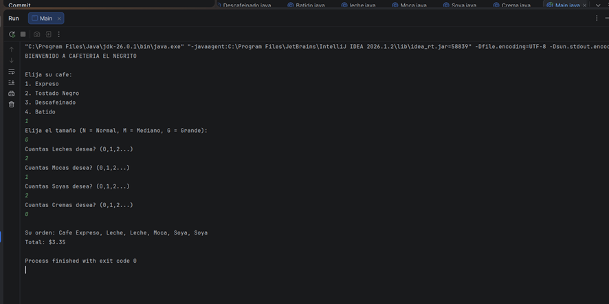

# Implementación del patrón Decorator

El proyecto utiliza el patrón de diseño **Decorator** para agregar complementos a las bebidas de café sin modificar las clases originales.

La idea principal es que cada bebida (Expreso, Tostado Negro, Descafeinado, Batido) es una clase base que representa un café simple con un precio y descripción.

A partir de estas bebidas base, se pueden agregar complementos como Leche, Moca, Soya y Crema, teniendo en cuenta que tambien se puede agregar 2 o mas veces un mismo complemento .

Cada complemento envuelve al anterior, formando una cadena de objetos que al final calcula el costo total.

Markdown